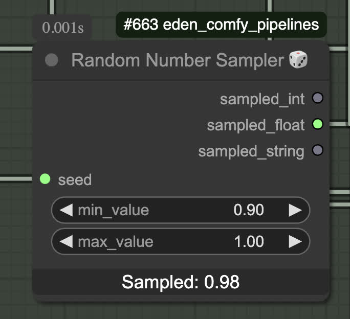

<div align="center">
  
  <h1>🌱 Eden ComfyUI Custom Node Suite</h1>
  <p>A comprehensive collection of specialized ComfyUI nodes for advanced generative AI workflows</p>
  <p><strong>Developed by <a href="https://www.eden.art/">Eden.art</a></strong></p>
</div>

---

## 📖 Overview

This repository contains 70+ custom ComfyUI nodes designed to enhance creative AI workflows with advanced image processing, depth manipulation, AI-powered text generation, logical operations, and sophisticated video effects. These nodes power many of the creative tools available on [Eden.art](https://www.eden.art/).

## 🚀 Quick Start

### Installation
```bash
cd ComfyUI/custom_nodes/
git clone https://github.com/edenartlab/eden_comfy_pipelines.git
cd eden_comfy_pipelines
pip install -r requirements.txt
```

### OpenAI Setup (Optional)
For GPT-powered nodes, create a `.env` file in your ComfyUI root directory:
```
OPENAI_API_KEY=your_api_key_here
```

---

## 🎯 Node Categories

### 🤖 AI & GPT Integration

#### **GPT4 Text Completion**


Advanced text generation with GPT-4 integration:
- **Eden_gpt4_node**: Direct GPT-4 API integration with customizable models (gpt-4o, gpt-4-turbo)
- **Eden_GPTPromptEnhancer**: Intelligently enhance basic prompts with detailed descriptions and artistic elements
- **Eden_GPTStructuredOutput**: Generate structured JSON responses following custom schemas

#### **GPT4 Vision & Image Analysis**


Powerful image understanding capabilities:
- **ImageDescriptionNode**: Generate detailed captions and descriptions from images
- **CLIP_Interrogator**: Extract comprehensive text descriptions using CLIP + BLIP models

---

### 🖼️ Advanced Image Processing

#### **Smart Image Loading & Management**


Intelligent batch processing tools:
- **LoadRandomImage**: Process multiple images with automatic aspect ratio correction
- **ImageFolderIterator**: Sequential image loading with index-based selection
- **LoadImagesByFilename**: Batch load images by filename patterns

#### **Precision Image Manipulation**


Professional image handling:
- **SaveImageAdvanced**: Enhanced saving with timestamps and metadata export
- **VAEDecode_to_folder**: Direct-to-disk VAE decoding for long sequences
- **IMG_padder/IMG_unpadder**: Smart padding with edge-color matching
- **IMG_scaler**: Mathematical operations on pixel values
- **IMG_blender**: Advanced image blending with weight control

#### **Color & Mask Generation**


Advanced segmentation tools:
- **MaskFromRGB_KMeans**: Generate precise masks using K-means color clustering
- **Eden_MaskCombiner**: Combine multiple masks with sophisticated blending
- **ConvertToGrayscale**: Professional grayscale conversion with alpha handling
- **HistogramMatching**: Match color distributions between images

---

### 🎭 Face Processing & Detection

Comprehensive face manipulation toolkit:
- **Eden_FaceToMask**: Automatic face detection and mask generation using MediaPipe
- **Eden_Face_Crop**: Intelligent face cropping with padding and boundary handling
- **Eden_ImageMaskComposite**: Advanced image compositing with mask support

---

### 📐 Depth & 3D Effects

#### **Depth Analysis & Manipulation**


Create stunning depth-based effects:
- **DepthSlicer**: Generate targeted masks from depth maps using K-means clustering
- **Eden_DepthSlice_MaskVideo**: Animated depth slicing for video sequences
- **ParallaxZoom**: 3D parallax effects from depth maps

#### **3D Parallax Animation**


- **ParallaxZoom**: Create immersive Deforum-style 3D zoom effects
- **AspectPadImageForOutpainting**: Intelligent padding for consistent aspect ratios

---

### 🎲 Logic & Control Flow

#### **Data Types & Comparisons**


Essential workflow control nodes:
- **Eden_RandomNumberSampler**: Visual random number generation with live display
- **Eden_Compare**: Advanced comparison operations for any data type
- **Eden_IfExecute**: Conditional execution based on boolean logic
- **Eden_BoolBinaryOperation**: Boolean algebra operations (AND, OR, XOR, etc.)

#### **Utilities & Conversion**
- **Eden_String/Int/Float/Bool**: Type conversion and value passing
- **Eden_Math**: Mathematical operations on numeric values
- **Eden_StringHash**: Generate deterministic hashes from strings
- **Eden_Debug_Anything**: Comprehensive debugging with type analysis

---

### 📁 File & Data Management

#### **File Operations**
- **GetRandomFile**: Random file selection from directories
- **FolderScanner**: Comprehensive folder analysis and file listing
- **Eden_AllMediaLoader**: Load various media types with validation
- **Eden_Save_Param_Dict**: Export workflow parameters as JSON

#### **Random Sampling & Selection**
- **Eden_RandomFilepathSampler**: Statistical file path sampling
- **Eden_RandomPromptFromFile**: Load random prompts from text files
- **Eden_randbool**: Random boolean generation with probability control

---

### 🎬 Video & Animation

#### **Video Processing**


Advanced video manipulation:
- **VideoFrameSelector**: Intelligent frame selection with temporal optimization
- **KeyframeBlender**: Smooth keyframe interpolation for animations
- **MaskedRegionVideoExport**: Export specific regions from video sequences
- **Extend_Sequence**: Loop and extend video sequences with various modes

#### **Animation Tools**
- **Animation_RGB_Mask**: Create animated masks from RGB data
- **AnimatedShapeMaskNode**: Generate animated geometric masks
- **OrganicFillNode**: Organic mask filling for seamless animations

---

### 🔄 IP Adapter & Embeddings

Advanced conditioning and style transfer:
- **Random_Style_Mixture**: Blend multiple style embeddings randomly
- **Linear_Combine_IP_Embeds**: Linear combination of IP adapter embeddings
- **SavePosEmbeds/Load_Embeddings_From_Folder**: Embedding management system
- **IP_Adapter_Settings_Distribution**: Control IP adapter influence distribution

---

## 🎨 Featured Workflows

The repository includes example workflows in `example_workflows/` showcasing:
- **3D Animation**: Depth-based parallax effects
- **Audio Processing**: Stem separation and audio manipulation  
- **Face Styling**: Expression transfer and face manipulation
- **Video Effects**: Frame blending and time remapping
- **AI Generation**: FLUX, SDXL, and other model workflows

---

## 🛠️ Technical Features

### **Memory Optimization**
- **LatentTypeConversion**: Convert between float16/float32 for memory efficiency
- **Eden_RepeatLatentBatch**: Efficient latent batch processing
- Smart tensor management across GPU/CPU

### **Resolution & Aspect Ratio**
- **WidthHeightPicker**: Smart resolution selection with multiple constraints
- **IMG_resolution_multiple_of**: Ensure dimensions are multiples of specific values
- **AspectPadImageForOutpainting**: Professional aspect ratio handling

### **String & Text Processing**
- **Eden_StringReplace**: Advanced string replacement with regex support
- **Eden_Regex_Replace**: Powerful regex pattern matching
- **Eden_RandomPromptFromFile**: Dynamic prompt loading from files

---

## 🎯 Use Cases

- **Creative AI Workflows**: Professional image and video generation
- **Batch Processing**: Automated processing of large image sets
- **3D Effects**: Depth-based animations and parallax effects  
- **Face Processing**: Portrait enhancement and manipulation
- **Content Creation**: Automated caption generation and description
- **Video Production**: Advanced video effects and frame manipulation
- **Research & Development**: Experimental AI workflows and testing

---

## 📚 Contributing

We welcome contributions! For workflow contributions, check out our production workflows repository: [edenartlab/workflows](https://github.com/edenartlab/workflows)

## 📄 License

This project is licensed under the MIT License - see the LICENSE file for details.

---

<div align="center">
  <p><strong>🌱 Built with ❤️ by the Eden.art team</strong></p>
  <p><a href="https://www.eden.art/">Visit Eden.art</a> | <a href="https://github.com/edenartlab/workflows">Production Workflows</a></p>
</div>