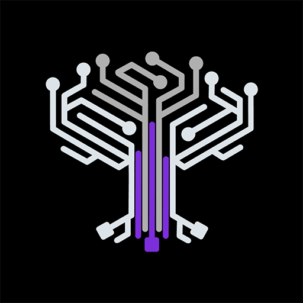

<div align="center">
  
  <h1>Eden.art Custom Node Suite for ComfyUI</h1>
  <p>A collection of powerful custom nodes and workflows developed by <a href="https://www.eden.art/">Eden</a></p>
  <br>
</div>

This repository contains a suite of specialized ComfyUI nodes that enhance your generative workflows. Some nodes may not be fully documented here yet but are actively used in [our workflows repository](https://github.com/edenartlab/workflows).

## 🌟 Featured Nodes

###  GPT4 Node


**Call GPT4 for text completion**
- A versatile node that wraps the OpenAI API
- Simply place a `.env` file in your root ComfyUI folder with your API key

---

###  GPT4 Vision Node


**Image captioning and understanding with GPT4-vision**
- Interpret images and generate detailed descriptions
- Requires an `.env` file with your OpenAI API key in the root ComfyUI folder

---

###  Load Random Images


**Dynamic random image loading for automated experiments**
- Queue your prompt multiple times to run workflows on different inputs
- Automatically crops multiple images to the same aspect ratio/resolution

---

###  Color Clustering Mask Generator


**Generate masks from images/videos using color clustering**
- Applies KMeans clustering to produce precise masks
- Particularly useful for creating AnimateDiff masks directly from source videos

---

###  DepthSlicer


**Create masks from depth maps**
- Slices depth maps in the z-direction to produce "depth slices"
- Perfect for creative animations and targeted inpainting

---

###  3D Parallax Zoom


**Create immersive 3D zoom effects**
- Given a depth map and an image, creates Deforum-style 3D-zoom parallax videos
- Adds dimension and movement to static images

---

###  CLIP Interrogator


**Extract text descriptions from images**
- Based on [clip-interrogator](https://github.com/pharmapsychotic/clip-interrogator)
- Features:
  - Optional model persistence in GPU memory with `keep_model_alive`
  - Control over BLIP caption inclusion with `prepend_BLIP_caption`
  - Automatic prompt saving with `save_prompt_to_txt_file`
  - If auto-download fails, manually clone https://huggingface.co/Salesforce/blip-image-captioning-large into ComfyUI/models/blip

---

###  VAEDecode to Folder


**Direct-to-disk VAE decoding**
- Saves decoded images directly to a specified folder
- Enables rendering of much longer videos with AnimateDiff
- Requires manual video compilation with ffmpeg afterward

---

###  Enhanced SaveImage


**Advanced image saving options**
- Add timestamps to filenames
- Automatically save the entire pipeline as a JSON file
- Easily reference prompts and settings without loading the full pipeline

---

> **Note:** Some nodes in this collection are still under development and may not be fully functional or documented.

## 🔧 Installation

```bash
cd ComfyUI/custom_nodes/
git clone https://github.com/edenartlab/eden_comfy_pipelines.git
cd eden_comfy_pipelines
pip install -r requirements.txt
```

## 🤝 Contributing

We welcome contributions! If you have ideas for new nodes or improvements to existing ones, please open an issue or submit a pull request.

## 📜 License

This project is licensed under the MIT License - see the LICENSE file for details.
