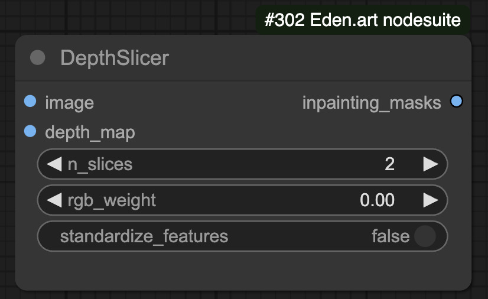
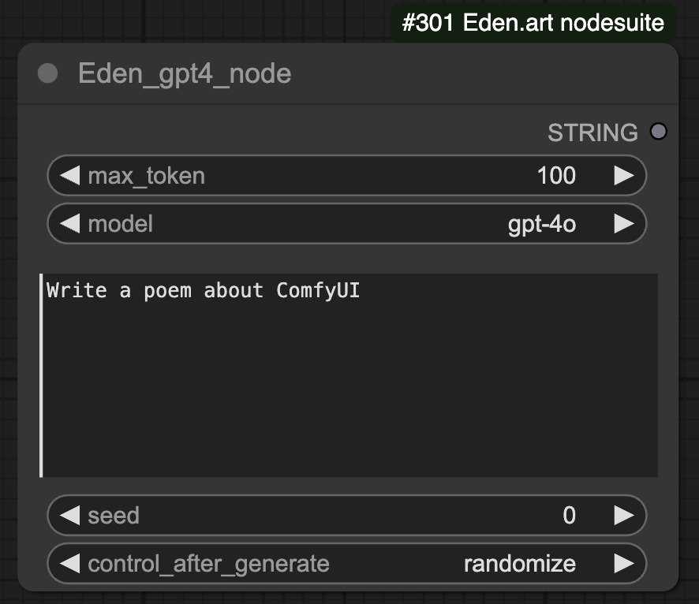
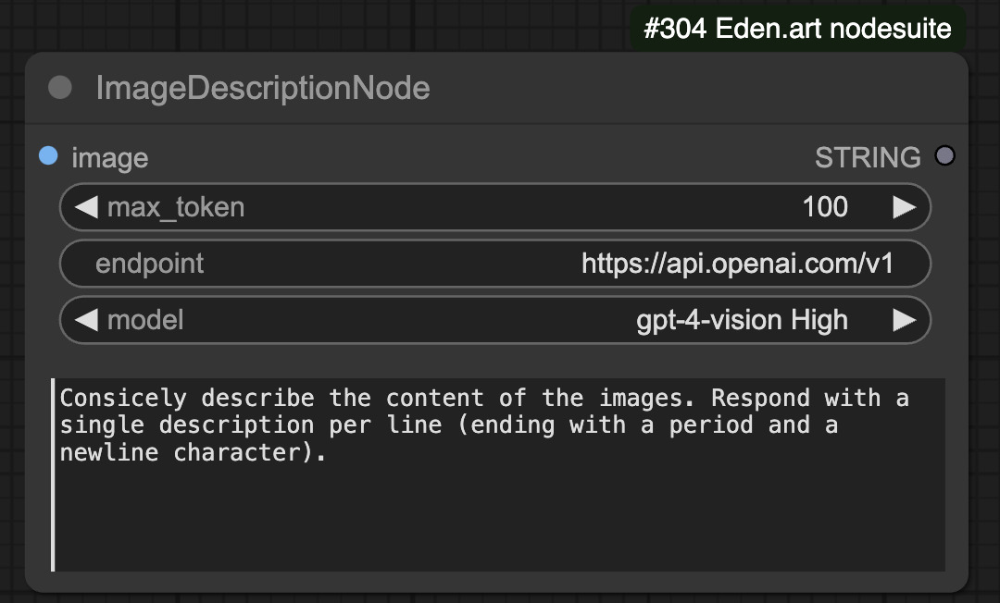
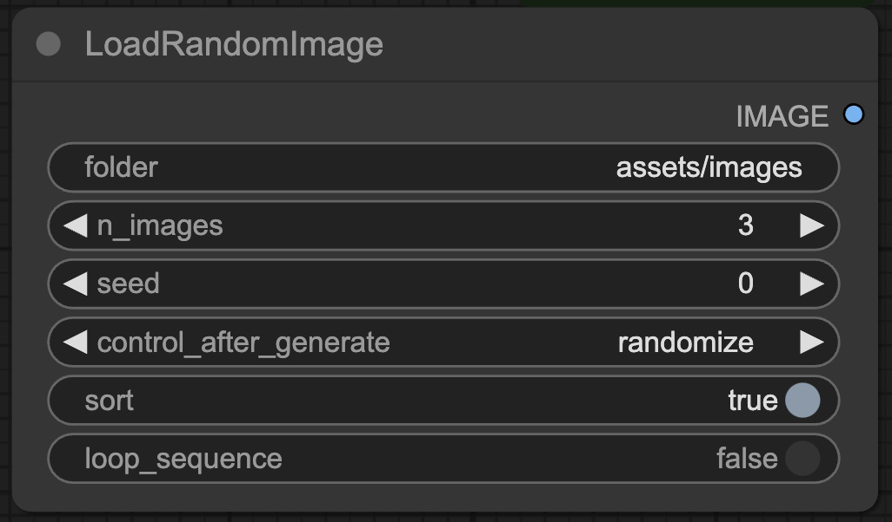
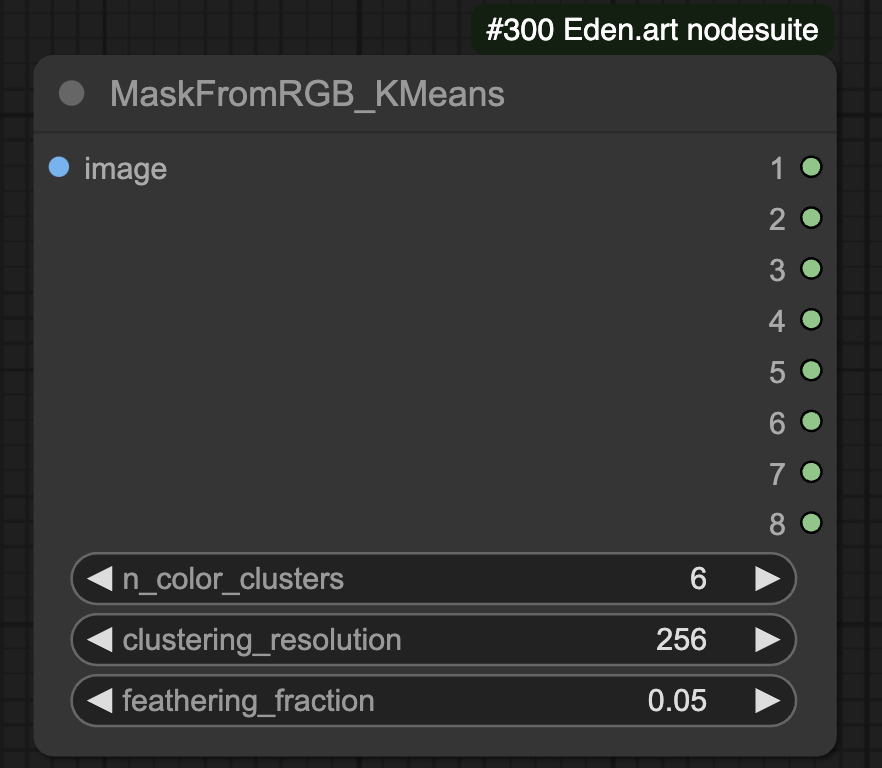
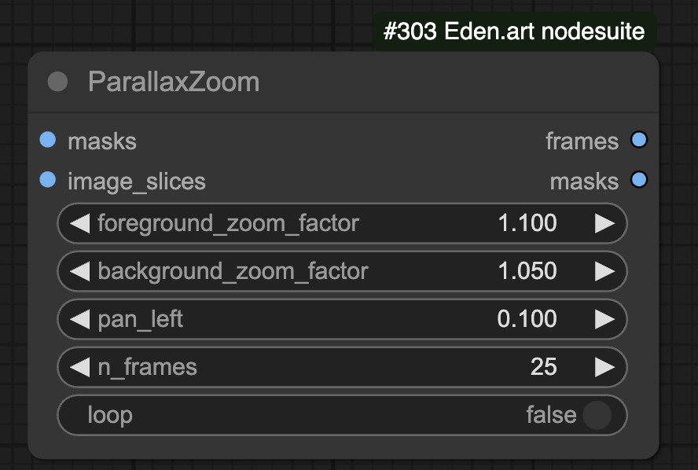
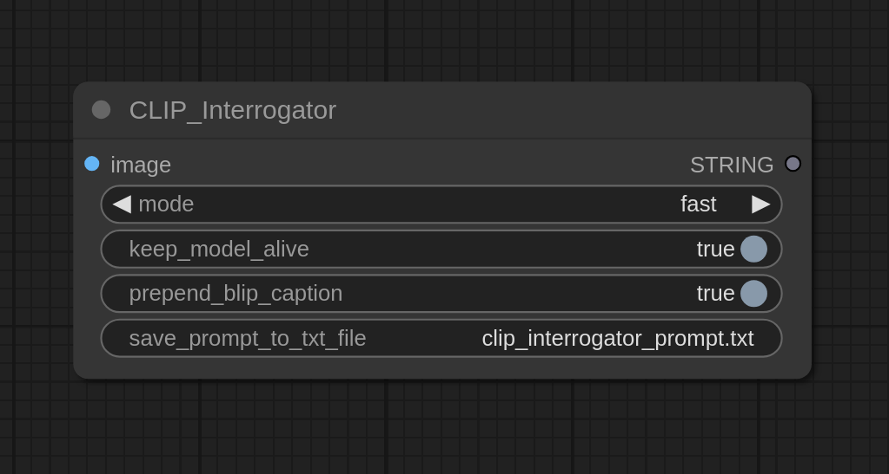
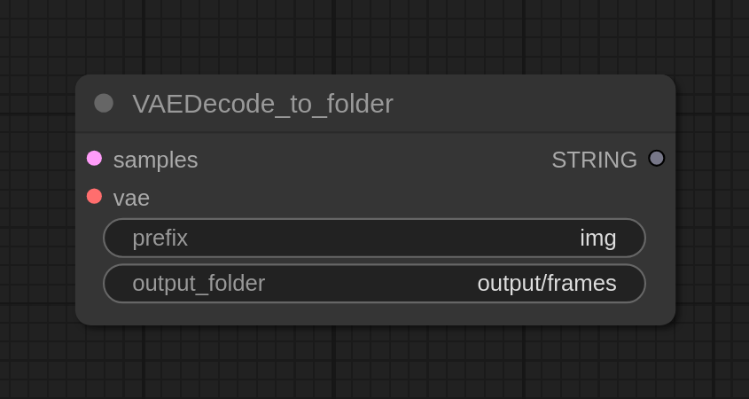
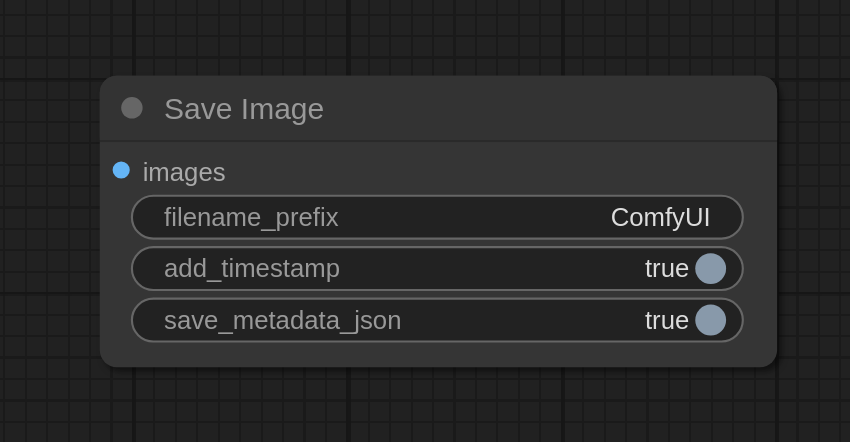

# Eden.art custom node Suite

A collection of custom nodes and workflows for ComfyUI, developed by [**Eden**](https://www.eden.art/).

Some nodes are not yet documented in this README but are used in [our workflows repo](https://github.com/edenartlab/workflows).

## Quick example of some of the most useful nodes:

<h3>DepthSlicer node</h3>

Generates masks from a depth map:

<ul>
    <li>This node takes a depth map as input and slices it in the z direction to produce "depth slices" that can be used for animations or inpainting.</li>
</ul>

<h3>GPT4 node</h3>

Call GPT4 for text completion:

<ul>
    <li>A very generic node that just wraps the OpenAI API. All you need is a .env file in the root comfyUI folder with your API key.</li>
</ul>

<h3>GPT4 vision node</h3>

Call GPT4-vision for image captioning / understanding

<ul>
    <li>A very generic node that just wraps the OpenAI API. All you need is a .env file in the root comfyUI folder with your API key.</li>
</ul>

<h3>Load random Images from a directory</h3>

Enables various random image loading formats to create auto-experiments.

<ul>
    <li> Just hit "queue prompt" several times and it will run the workflow on different inputs. When multiple images are loaded, it will auto-crop them to the same aspect ratio / resolution.</li>
</ul>

<h3>Generate (video) masks from an input image/video using color clustering</h3>

Applies KMeans clustering to the colors of an input image/video to produce output masks

<ul>
    <li> This node is super useful when generating masks for eg AnimateDiff directly from a source video</li>
</ul>

<h3>3D Parallax Zoom</h3>

Applies 3D depth zooming to an image

<ul>
    <li>Given a depth map and an image, this node creates a 3D-zoom parallax video, Deforum Style.</li>
</ul>

<h3>CLIP_interrogator node</h3>

Based off <a href="https://github.com/pharmapsychotic/clip-interrogator">clip_interrogator</a>.

This is a simple CLIP_interrogator node that has a few handy options:

<ul>
    <li>If the auto-download fails, just clone https://huggingface.co/Salesforce/blip-image-captioning-large into ComfyUI/models/blip </li>
    <li>"keep_model_alive" will not remove the CLIP/BLIP models from the GPU after the node is executed, avoiding the need to reload the entire model every time you run a new pipeline (but will use more GPU memory).</li>
    <li>"prepend_BLIP_caption" can be turned off to only get the matching modifier tags but not use a BLIP-interrogation. Useful if you're using an image with IP_adapter and are mainly looking to copy textures, but not global image contents.</li>
    <li>"save_prompt_to_txt_file" to specify a path where the prompt is saved to disk.</li>
</ul>

<h3>VAEDecode_to_folder node</h3>

Decodes VAE latents to imgs, but saves them directly to a folder. This allows rendering much longer videos with, for example, AnimateDiff (manual video compilation with ffmpeg required in post).

<h3>SaveImage node</h3>

A basic Image saver with the option to add timestamps and to also save the entire pipeline as a .json file (so you can read prompts and settings directly from that .json file without loading the entire pipe).

<strong>NOTE:</strong> Some of the included nodes aren't finished yet!

