<div align="center">

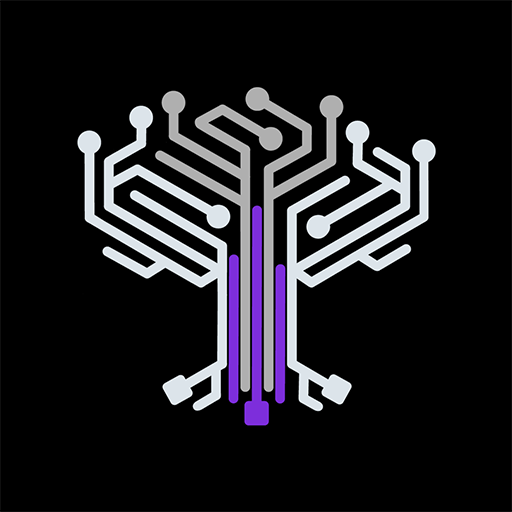

# Eden ComfyUI Pack

**80+ nodes for masks, animation, color, depth, media loading and workflow logic.**<br>
Built and used in production by [Eden.art](https://www.eden.art/).

[](https://registry.comfy.org/nodes/eden_comfy_pipelines)
[](LICENSE)

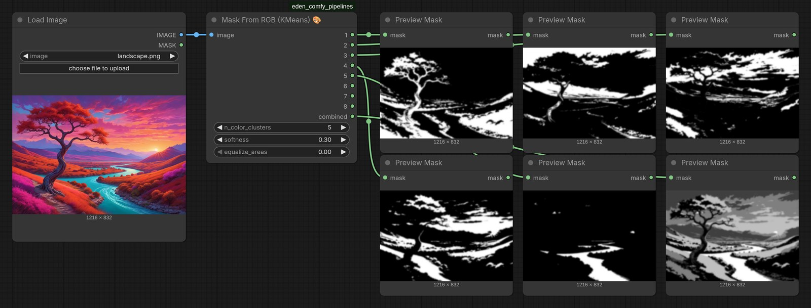

</div>

## Installation

Search for **Eden Comfy Pack** in ComfyUI Manager, or:

```bash
comfy node install eden_comfy_pipelines
```

<details>
<summary>Manual install</summary>

```bash
cd ComfyUI/custom_nodes
git clone https://github.com/edenartlab/eden_comfy_pipelines.git
pip install -r eden_comfy_pipelines/requirements.txt
```
</details>

Requires ComfyUI 0.3.48+. All nodes are under **Eden 🌱** in the node library, with tooltips on nearly every input.

---

## Highlights

### 🎨 Mask From RGB (KMeans)

Splits an image or a whole video into up to 8 soft color-region masks, plus a combined grayscale map (top image). Clustering runs once over all frames, so each mask tracks the same colors through a video. This is the node behind Eden's **TextureFlow** workflow.

- `n_color_clusters`: number of masks.
- `softness`: how feathered the edges are.
- `equalize_areas`: evens out mask sizes.

### 🌿 Organic Fill Animation

Grows a noisy, organic fill through the dark shape of any image and returns a mask video. `loop` plays it back out again. **Organic Fill Random 🎲** samples every growth parameter from a seed, for quick variations.

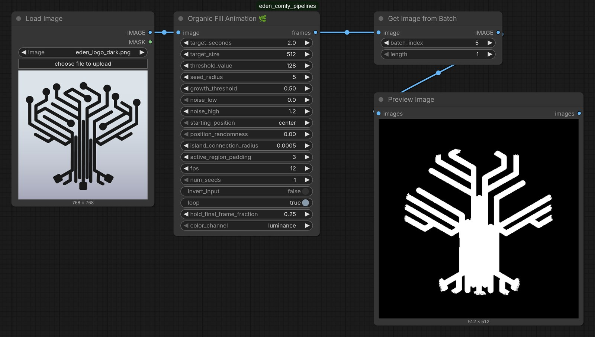
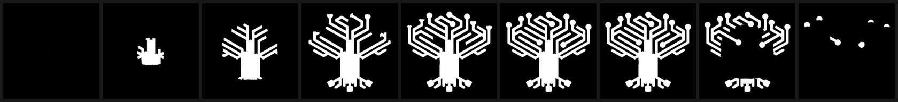

### 🌀 Animated masks

**Animated Shape Mask** makes moving bands, sine waves and growing or shrinking circles, with soft gradient edges. **Animation RGB Mask** makes looping multi-region patterns (rotating or pushing segments, concentric circles or rectangles, stripes). Both are useful as masks for regional prompting and for AnimateDiff or IP-Adapter attention masks.

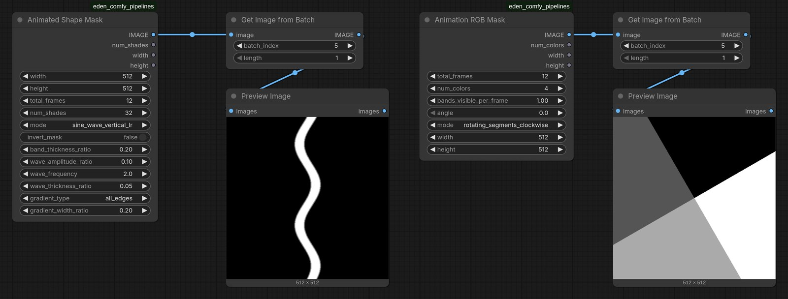
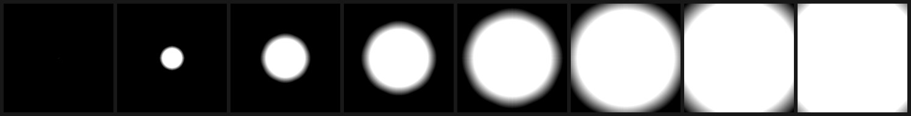
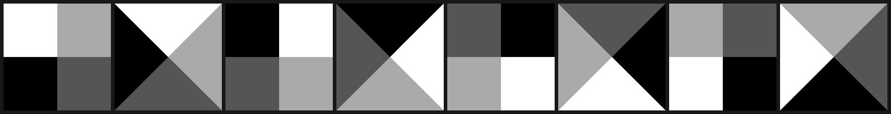

### 🌈 Histogram Matching

Transfers the color distribution of a reference image onto any batch of images. `matching_fraction` blends between the original and the fully matched result.

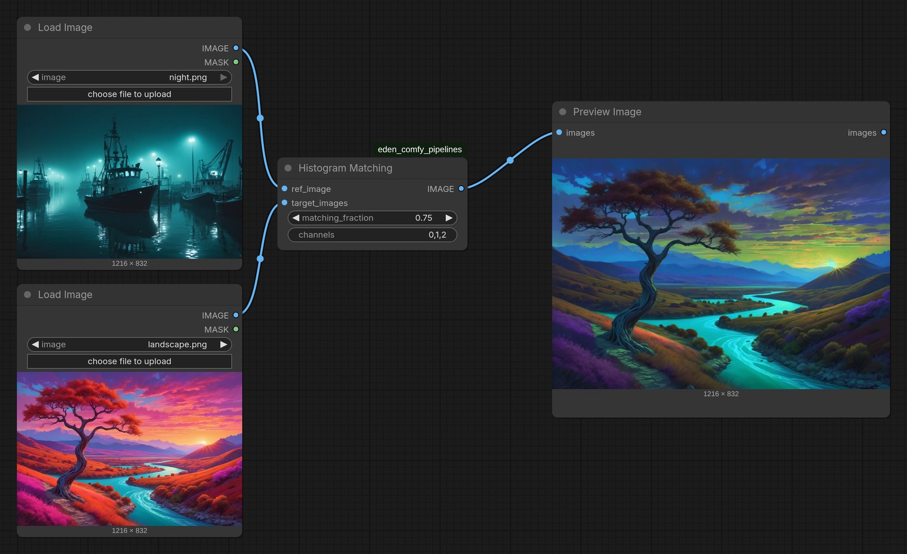

### ➗ Image / Mask Math

Write any expression over the inputs `a`, `b`, `c`, such as `a * b`, `sin(a*pi) * b + c` or `max(a, b)`. Images and masks broadcast to each other automatically, and the result comes out as both an IMAGE and a MASK. Here a KMeans mask cuts one color region out of the image:

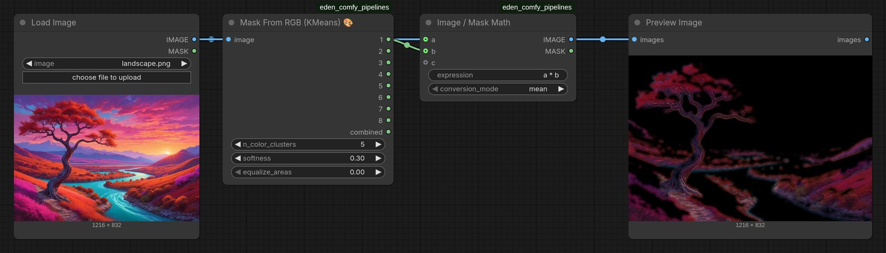

### 🔀 Logic, math and randomness

- **If ANY Execute A Else B** is *lazy*: only the branch it picks runs, so the other branch's nodes never execute.
- **Compare**, **Math Expression**, **Int / Float / Bool / String** and **Bool Binary Operation** cover everyday control flow.
- **Random Number Sampler** shows the last value it drew right on the node.
- Every random node uses its own seeded generator, so none of them resets the global random state for other nodes.

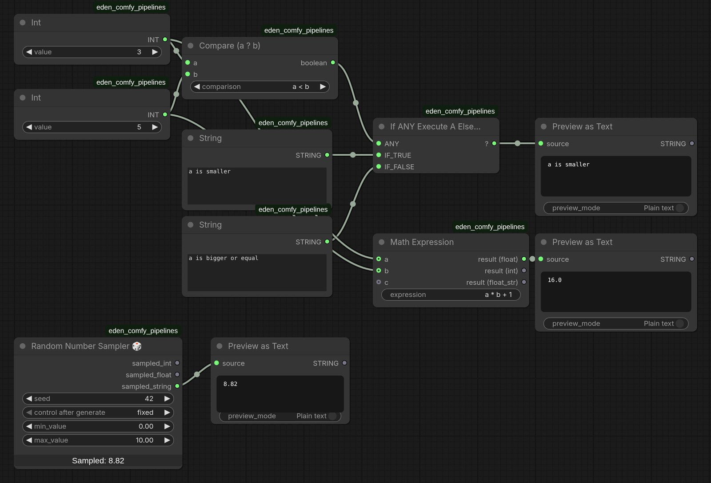

### 📝 Prompt from Image Folder

Point it at a folder of ComfyUI renders and it returns the positive prompt that made one of them. It traces the workflow embedded in the PNG from the sampler back to its text encoder. Use `seed` to step through the folder or pick at random.

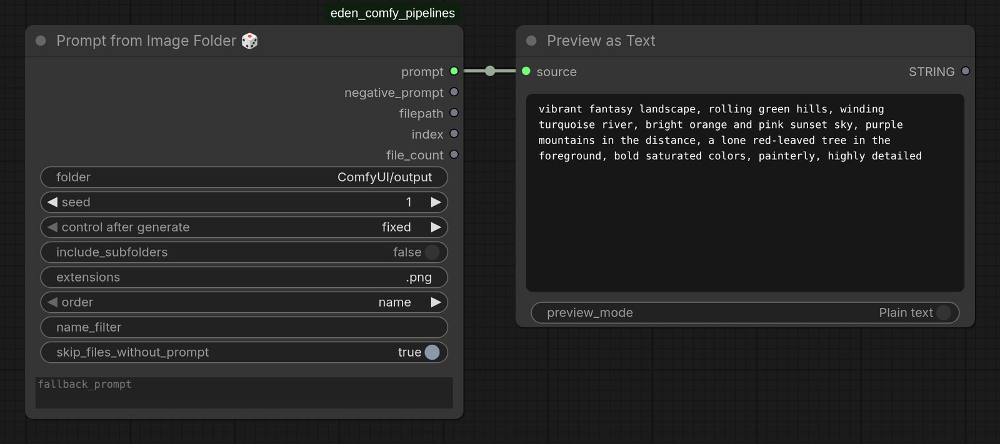

### 📐 Depth & parallax

- **Depth Slicer**: splits an image into depth layers.
- **Parallax Zoom**: turns those layers into a Deforum-style 2.5D zoom/pan video.
- **Depth Slice Mask Video**: sweeps a thin depth band through the scene, for reveal animations.

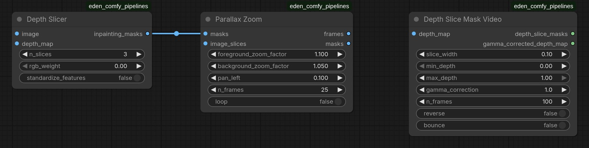

### 📁 Loaders & savers

- **All Media Loader**: one node for an image, a folder, a glob pattern, a video (mp4/mov/webm/mkv/avi), a GIF or a zip/tar/7z of images, with frame-rate subsampling and a max resolution.
- **Load Random Image(s)**: a seeded batch from a folder.
- **Save Image Advanced (Eden)**: adds a timestamp and a sidecar JSON of the workflow.
- Folder loaders re-run when the files in the folder change, and stay cached otherwise.

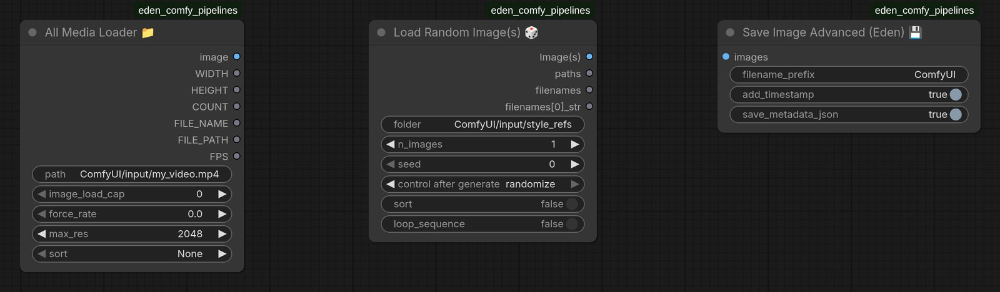

### 🤖 AI helpers

- **GPT Prompt Enhancer**, **GPT-4 Completion**, **GPT Structured Output (JSON)** and **GPT Image Description** use your OpenAI key.
- **CLIP Interrogator** runs locally and turns an image into an SD-style prompt.

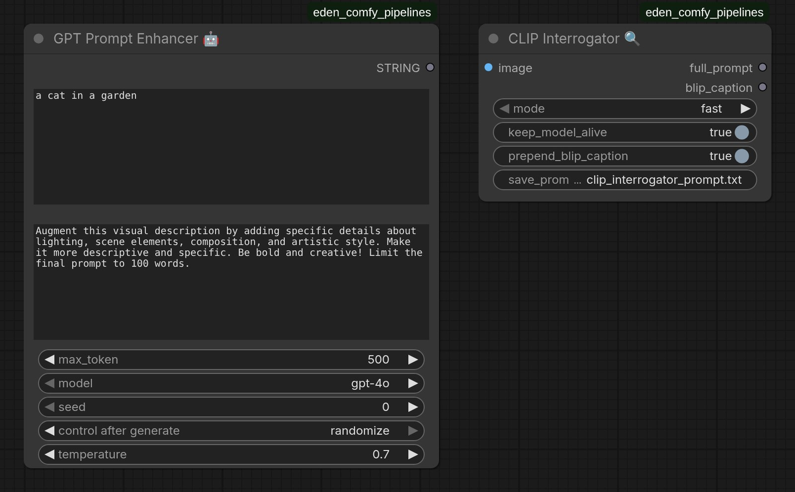

The GPT nodes read `OPENAI_API_KEY` from the environment, or from a `.env` file in the ComfyUI root.

---

## All nodes

The name in `code` is the node id stored in saved workflows.

<details>
<summary><b>🎭 Mask</b> (9)</summary>

| Node | What it does |
|---|---|
| **Mask From RGB (KMeans) 🎨** `MaskFromRGB_KMeans` | Color-region masks for images and video |
| **Mask Combiner** `Eden_MaskCombiner` | Blends up to 3 masks with signed strengths and a soft percentile clamp |
| **Mask Bounding Box Crop** `Eden_MaskBoundingBox` | Crops a mask (and image) to the mask's bounding box, after removing speckles |
| **Face to Mask (MediaPipe)** `Eden_FaceToMask` | A rectangle mask per detected face (needs the legacy `mediapipe` *solutions* API) |
| **Animated Shape Mask** `AnimatedShapeMaskNode` | Moving band, sine wave or growing/shrinking circle masks |
| **Animation RGB Mask** `Animation_RGB_Mask` | Looping multi-region band animations |
| **Organic Fill Animation 🌿** `Eden_OrganicFillAnimation` | Organic growth filling a shape |
| **Organic Fill Random 🎲** `Eden_OrganicFillRandom` | The same, with parameters sampled from a seed |
| **Gradient Border Mask** `Eden_GradientBorderMask` | White image with edges fading to black |
</details>

<details>
<summary><b>🖼️ Image</b> (15)</summary>

| Node | What it does |
|---|---|
| **Image / Mask Math** `Eden_Image_Math` | Expression over image/mask tensors `a`, `b`, `c` |
| **Image Math (Pixel Expression)** `IMG_scaler` | Expression over every pixel value `x` |
| **Image Blender** `IMG_blender` | Weighted blend of two batches |
| **Histogram Matching** `HistogramMatching` | Color transfer from a reference image |
| **Convert to Grayscale** `ConvertToGrayscale` | 3-channel grayscale, RGBA-aware |
| **RGBA to RGB** `Eden_RGBA_to_RGB` | Flattens alpha onto a background |
| **Image Padder / Unpadder** `Eden_IMG_padder` / `Eden_IMG_unpadder` | Adds or removes an edge-colored border |
| **Crop to Resolution Multiple** `IMG_resolution_multiple_of` | Crops to multiples of N |
| **Aspect Pad Image for Outpainting** `AspectPadImageForOutpainting` | Pads to an SDXL aspect ratio |
| **Image Mask Composite** `Eden_ImageMaskComposite` | Pastes a source onto a destination through a mask |
| **Face Crop** `Eden_Face_Crop` | Crops around a face mask and returns paste-back info |
| **Width/Height Picker** `WidthHeightPicker` | Scales a resolution and rounds it to a multiple |
| **Projection Preview (Additive)** `ProjectionPreview` | Simulates a projection on a textured surface |
| **Surface Radiometric Compensation** `SurfaceRadiometricCompensation` | Projector image that compensates for the surface |
</details>

<details>
<summary><b>📐 Depth & 🎬 Video</b> (7)</summary>

| Node | What it does |
|---|---|
| **Depth Slicer** `DepthSlicer` | Depth layers via k-means |
| **Parallax Zoom** `ParallaxZoom` | 2.5D zoom/pan video from layers |
| **Depth Slice Mask Video** `Eden_DepthSlice_MaskVideo` | Sweeping depth-band masks |
| **Video Frame Selector** `VideoFrameSelector` | Evenly spaced frames and an interpolation multiplier for a target fps |
| **Keyframe Blender 🎞️** `KeyframeBlender` | Crossfades keyframes and IP-Adapter embeds with per-frame masks |
| **Extend Sequence (Loop / Ping-Pong)** `Extend_Sequence` | Loops or ping-pongs a sequence to N frames |
| **Determine Frame Count** `Eden_DetermineFrameCount` | Snaps a frame count to a multiple of the source length |
</details>

<details>
<summary><b>📁 Loaders & savers</b> (10)</summary>

| Node | What it does |
|---|---|
| **All Media Loader 📁** `Eden_AllMediaLoader` | Images, folders, globs, videos, GIFs, archives |
| **Load Random Image(s) 🎲** `LoadRandomImage` | A seeded batch from a folder |
| **Image Folder Iterator** `ImageFolderIterator` | The image at an index in a folder |
| **Load Images by Filename** `LoadImagesByFilename` | Loads images from a list of paths |
| **Get Random File 🎲** `GetRandomFile` | A seeded random file path |
| **Load Prefixed Images** `Get_Prefixed_Imgs` | Latest images whose name contains a prefix |
| **Save Image Advanced (Eden) 💾** `Eden_SaveImageAdvanced` | PNG with a timestamp and a workflow JSON |
| **VAE Decode to Folder** `VAEDecode_to_folder` | Decodes latents straight to disk, frame by frame |
| **Masked Region Video Export (Alpha)** `MaskedRegionVideoExport` | Transparent webm/ProRes video (needs `ffmpeg`) |
| **Save Param Dict 📁** `Eden_Save_Param_Dict` | Saves up to 10 key/value pairs as JSON |
</details>

<details>
<summary><b>🔀 Logic, 🎲 Random & ✏️ Text</b> (21)</summary>

| Node | What it does |
|---|---|
| **If ANY Execute A Else B 🔀** `If ANY execute A else B` | Lazy if/else on any value |
| **Compare (a ? b)** `Eden_Compare` | `==`, `!=`, `<`, `>`, `<=`, `>=` on any type |
| **Bool Binary Operation** `Eden_BoolBinaryOperation` | And, Or, Xor, Nand, … |
| **Math Expression** `Eden_Math` | Expression in `a`, `b`, `c`; returns FLOAT, INT and STRING |
| **Int / Float / Bool / String** `Eden_Int` / `Eden_Float` / `Eden_Bool` / `Eden_String` | Constants |
| **Int to Float / Float to Int** `Eden_IntToFloat` / `Eden_FloatToInt` | Conversions |
| **SD Type to String / SD Any-Type Converter** `SDTypeConverter` / `SDAnyConverter` | Combo → string, or any → wildcard |
| **Random Number Sampler 🎲** `Eden_RandomNumberSampler` | A seeded number, shown on the node |
| **Random Bool 🎲** `Eden_randbool` | True with a given probability |
| **Random Filepath Sampler 🎲** `Eden_RandomFilepathSampler` | A seeded file, with filters |
| **Prompt From File (by Seed) 🎲** `Eden_RandomPromptFromFile` | Line `seed % n` of a text file |
| **Seed 🎲** `Eden_Seed` | A seed as INT and STRING |
| **Prompt from Image Folder 🎲** `Eden_PromptFromImageFolder` | Recovers the prompt of a render in a folder |
| **String Replace** `Eden_StringReplace` | Plain text replacement |
| **Regex Replace** `Eden_Regex_Replace` | `re.sub` with a count and case sensitivity |
| **String Hash** `Eden_StringHash` | Deterministic hash of a string |
</details>

<details>
<summary><b>🤖 AI, 🔄 IP-Adapter & latent</b> (13)</summary>

| Node | What it does |
|---|---|
| **GPT-4 Completion 🤖** `Eden_gpt4_node` | Prompt in, reply out |
| **GPT Prompt Enhancer 🤖** `Eden_GPTPromptEnhancer` | Rewrites a prompt following instructions |
| **GPT Structured Output (JSON) 🤖** `Eden_GPTStructuredOutput` | JSON reply following a schema |
| **GPT Image Description 🤖** `ImageDescriptionNode` | Captions an image with GPT-4o |
| **CLIP Interrogator 🔍** `CLIP_Interrogator` | Local image-to-prompt |
| **IP-Adapter Settings** `IP_Adapter_Settings_Distribution` | Shared weight and weight type |
| **Random Style Mixture 🎲** `Random_Style_Mixture` | Random weighted mixes of style embeds |
| **Linear Combine IP Embeds** `Linear_Combine_IP_Embeds` | Interpolates two embeds |
| **Save / Load IP-Adapter Embeds** `SavePosEmbeds` / `Load_Embeddings_From_Folder` / `FolderScanner` | Caches embeds as `.pth` next to their images |
| **Latent Type Conversion (fp16/fp32)** `LatentTypeConversion` | Casts latents to halve memory |
| **Repeat Latent Batch** `Eden_RepeatLatentBatch` | Repeats a latent batch and its noise mask |
</details>

<details>
<summary><b>🐞 Utils & deprecated</b> (2)</summary>

| Node | What it does |
|---|---|
| **Debug Anything 🐞** `Eden_Debug_Anything` | Logs type, shape, stats and a preview of any value |
| **Organic Fill Mask Animation (Deprecated)** `OrganicFillNode` | Kept for old workflows; use **Organic Fill Animation** |
</details>

---

## Workflow compatibility

Node ids, inputs, defaults and outputs never change between versions, so workflows saved with older versions keep working.

Since May 2026, ComfyUI core has its own node with the id `SaveImageAdvanced`, and core ids always win. This pack's saver is now `Eden_SaveImageAdvanced`. Old workflows are migrated automatically: opening one in the UI renames the node, and API prompts that use Eden's inputs are routed to the Eden node on the server.

## More

- Example graphs: [`example_workflows/`](example_workflows/)
- Eden's production workflows: [edenartlab/workflows](https://github.com/edenartlab/workflows)
- Issues and ideas: [GitHub issues](https://github.com/edenartlab/eden_comfy_pipelines/issues)

MIT licensed. 🌱 Made by [Eden.art](https://www.eden.art/).
